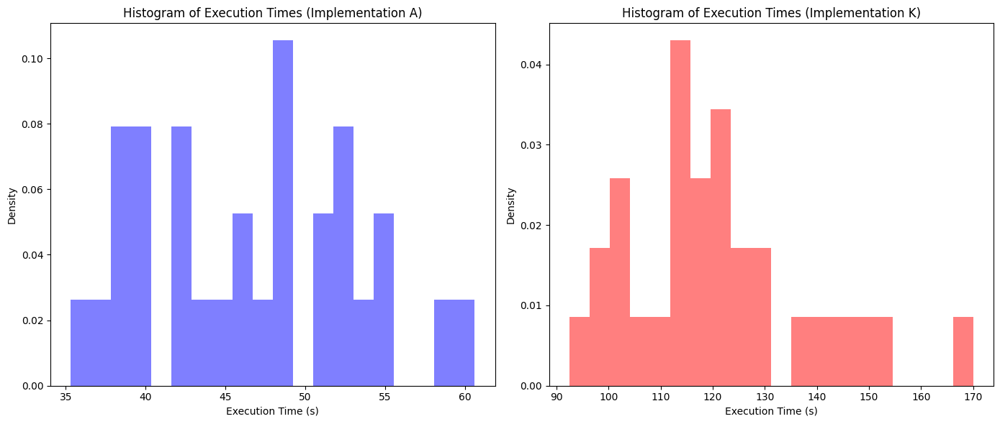
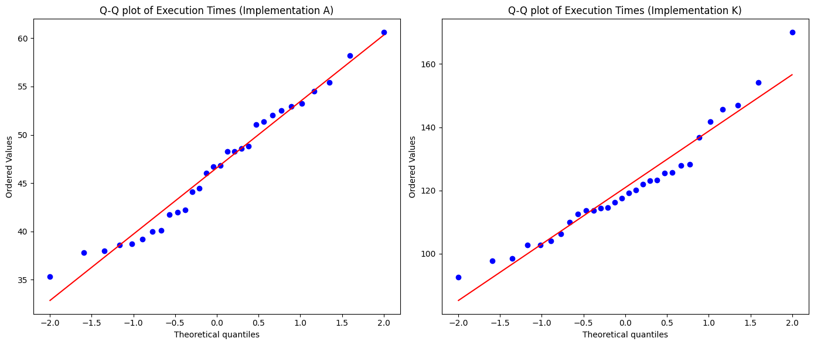
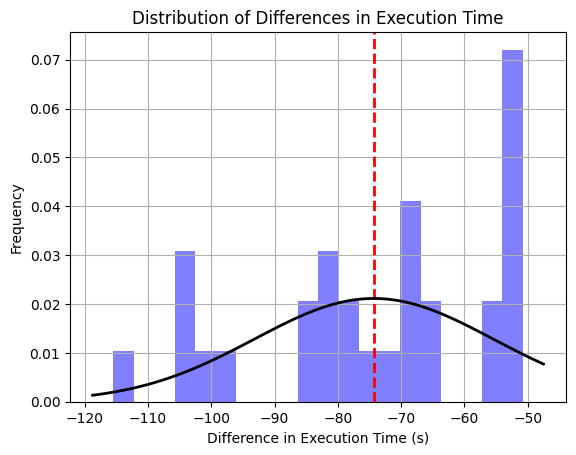
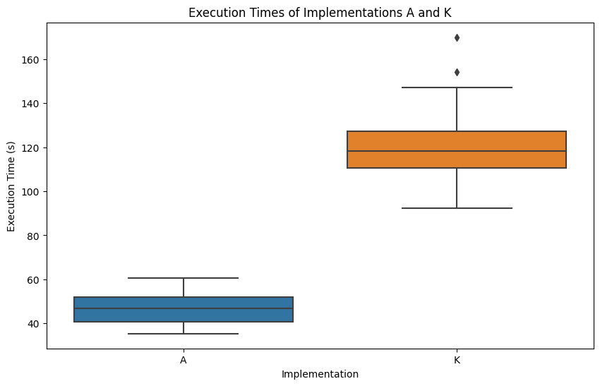
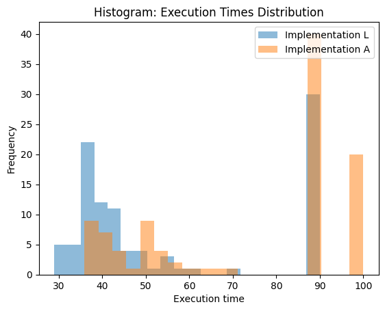
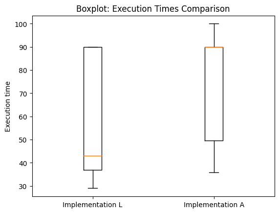
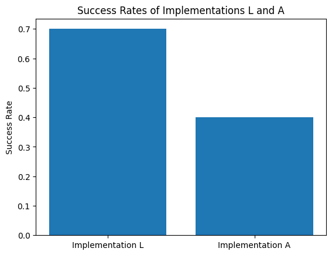

# Assignment 3 (Course "Researach Track 2" at UniGe, Italy)

### Changes made to the assignment submitted as part of course of "research track 1"

1. The robot can now robustly and in real-time, determine if all the tokens have been reached, without having to previously state how many tokens are present in the environment.

2. The assignment implementation has been subjected to stringent evaluation for failure, which includes the distance between, or the orientation difference between the tokens who have been paired (delivered) - even very small differences in my implementation (A) are treated as failres.

3. The implementation can now detect if the robot got stuck in a loop while searching for tokens and can break out of the loop, denoting a failure.

4. The implementation can now detect if the robot got stuck in a loop while delivering tokens and can break out of the loop, denoting a failure.

5. A new function to randomize the tokens in the original circles has been implementation to provide a "randomized environment" for performing tests. The function is presented below:
    ```python
    def place_token_random(radius, max_a=2*pi, number_offset=0):
        token_type = SilverToken if radius == INNER_CIRCLE_RADIUS else GoldToken
        rotation_amount = 0
        for i in range(TOKENS_PER_CIRCLE):
            token = token_type(self, number_offset + i)
            angle = random.uniform(0, max_a)
            token.location = (cos(angle) * radius, sin(angle) * radius)
            token.heading = rotation_amount
            self.objects.append(token)
    ```
    The function is simply called as follows:
    ```python
        place_token_random(INNER_CIRCLE_RADIUS)
        place_token_random(OUTER_CIRCLE_RADIUS, number_offset=TOKENS_PER_CIRCLE)
    ```
6. In the main algorithm file (assignment.py) a few changes were made to write the data to an `execution_times.csv` file as soon as either the task was completed or a failure was detected. Times were calculated by using the `time.time()` function in different places. The function to write the data is presented below:
    ```python
    def write_execution_times(exec_time):
        """
        Function to write the execution times to a csv file.
        Args: exec_time(float): Execution time of the program.
        """
        file_path = os.path.abspath('execution_times.csv')
        file_exists = os.path.isfile(file_path)

        with open(file_path, 'a') as csvfile:
            writer = csv.writer(csvfile)
            if not file_exists:
                writer.writerow(["Execution Time"])
            # Write the execution time for this run
            writer.writerow([exec_time])
    ```
7. A new python script `analyze.py` was created to automate the process of running multiple instances of the assignment in parallel, for faster collection of data. The script can be run by a command, whose usage is presented below:
    ```bash
    usage: python analyze.py [-h] [-b BATCHES] [-r REPS] [-m METRICS_INTERVAL]

    Run the simulation batches with specified repititions, and calculate various
    metrics associated with the simulation of the game.

    optional arguments:
    -h, --help            show this help message and exit
    -b BATCHES, --batches BATCHES
                            Number of batches to run the simulation for.
    -r REPS, --reps REPS  Number of repititions of sim per batch.
    -m METRICS_INTERVAL, --metrics_interval METRICS_INTERVAL
                            Number of batches after which to calculate metrics.
    ```
    This helps in running the assignment in parallel, and collecting data for analysis.

In our study, we aimed to compare the performances of different implementations of the **Assignment 1** of the course: ***Research Track 1***, specifically, implementations A (self-made), K (by colleague Kazuto), and L (by colleague Lucas P.), based on their execution times and success rates. At a time, implementation A is either compared with K or L, for evaluating differnt results. The results are presented in the following sections.

##### Hypotheses presented (stated crudely, formally stated in the following sections):
1. Implementation A and Implementation K have the same execution times.
2. Implementation A has a lower success rate than Implementation L.

##### Data Collection:
1. The data of **30** successful runs in randomized environment was collected for both implementations A and K, and the execution times were recorded in the files `data/ImplementationK/randomenv_exec_timesA.csv` and `data/ImplementationK/randomenv_exec_timesK.csv`.
2. The data of **100** runs in randomized environment was collected for both implementations L and A, and the execution times were recorded in the files `data/ImplementationL/random_10.txt` and `data/ImplementationA/execution_times_randomized_env.csv`.


```python
import os
import numpy
import scipy
import matplotlib.pyplot as plt
import pandas as pd
import seaborn as sns
```

## Hypotheses 1:

Let $μ_A$ denote the mean execution time of Implementation A, and let $μ_K$ denote the mean execution time of Implementation K.

1. **Null Hypothesis (H0):** There is no difference in the mean execution times of the two implementations. Formally, $μ_A = μ_K$.

2. **Alternative Hypothesis (H1):** The mean execution time of Implementation A is less than that of Implementation K. Formally, $μ_A < μ_K$.

Load Data for testing hypothesis 1:


```python
# Load data
current_dir = os.getcwd()
path_dataK = os.path.join(current_dir, 'data', 'ImplementationK', 'randomenv_exec_timesK.csv')
path_dataA = os.path.join(current_dir, 'data', 'ImplementationK', 'randomenv_exec_timesA.csv')
exec_timesK = numpy.loadtxt(path_dataK, delimiter=',', skiprows=1)
exec_timesA = numpy.loadtxt(path_dataA, delimiter=',', skiprows=1)

print("Exec Times A: ", exec_timesA, "\n")
print("Exec Times K: ", exec_timesK)
```

    Exec Times A:  [37.77668095 44.46400499 46.03198314 48.29454112 52.03829789 52.49213696
     53.23186183 58.21002698 60.60602117 38.69818592 44.10883617 46.81135011
     48.26659417 48.57106709 48.82675385 51.3419888  35.30833578 39.20498109
     40.11223507 41.75994897 41.95576787 46.69194889 51.07402396 55.39902592
     38.0034678  38.56418085 40.00610495 42.24549413 52.92601895 54.50770593] 
    
    Exec Times K:  [ 92.46227002  97.73628497  98.43292904 102.74572396 102.78263998
     103.96677399 106.22474217 109.98327923 112.4817009  114.29829097
     113.56836295 113.71793604 114.49517894 116.24606919 117.54107499
     119.26594591 120.08769798 121.99174118 123.00483704 123.31274796
     125.65598512 125.45696402 127.80762506 128.30329585 136.83233404
     141.80344486 145.60325098 147.01184607 154.07681584 170.03156209]


#### Visuliaze data:


```python
import scipy.stats as stats

# Histograms
plt.figure(figsize=(14,6))

plt.subplot(1,2,1)
plt.hist(exec_timesA, bins=20, alpha=0.5, color='blue', density=True)
plt.title('Histogram of Execution Times (Implementation A)')
plt.xlabel('Execution Time (s)')
plt.ylabel('Density')

plt.subplot(1,2,2)
plt.hist(exec_timesK, bins=20, alpha=0.5, color='red', density=True)
plt.title('Histogram of Execution Times (Implementation K)')
plt.xlabel('Execution Time (s)')
plt.ylabel('Density')

plt.tight_layout()
plt.show()

# Q-Q plots
plt.figure(figsize=(14,6))

plt.subplot(1,2,1)
stats.probplot(exec_timesA, plot=plt)
plt.title('Q-Q plot of Execution Times (Implementation A)')

plt.subplot(1,2,2)
stats.probplot(exec_timesK, plot=plt)
plt.title('Q-Q plot of Execution Times (Implementation K)')

plt.tight_layout()
plt.show()
```


    

    


    

    


A nice thing to notice here is the use of the Q-Q plot, or "Quantile-Quantile" plot. It is a powerful tool to visualize the distribution of a sample of data by comparing it to a known distribution (theoretical distribution). The points in the plot are plotted in such a way that the points should form a straight line. If the points are not on a straight line, then the distribution of the sample data does not match the theoretical distribution - the normal distribution in our case. The Q-Q plot is a good way to see if the data is normally distributed or not.

We can clearly notice that the blue points are roughly along the red line, which means that the data is normally distributed.

#### Check normality of data using Shapiro-Wilk test:


```python
from scipy.stats import shapiro

# test for normality
stat, p_value = shapiro(exec_timesA)

# interpret
alpha = 0.05
if p_value > alpha:
    print('Sample A looks Gaussian (fail to reject H0)')
else:
    print('Sample A does not look Gaussian (reject H0)')

```

    Sample A looks Gaussian (fail to reject H0)


```python
from scipy.stats import shapiro

# test for normality
stat, p_value = shapiro(exec_timesK)

# interpret
alpha = 0.05
if p_value > alpha:
    print('Sample K looks Gaussian (fail to reject H0)')
else:
    print('Sample K does not look Gaussian (reject H0)')

```

    Sample K looks Gaussian (fail to reject H0)


```python
import matplotlib.pyplot as plt
from scipy.stats import norm

# Compute differences
differences = exec_timesA - exec_timesK

# Computing mean difference
mean_diff = numpy.mean(differences)

# Computing standard deviation of differences
std_dev_diff = numpy.std(differences)

# Print results
print("Mean difference: " + str(mean_diff))
print("Standard deviation of differences: " + str(std_dev_diff))

# Plot histogram of differences
plt.hist(differences, bins=20, alpha=0.5, color='blue', density=True)
plt.axvline(mean_diff, color='red', linestyle='dashed', linewidth=2)  # Mean difference

# Plot the normal distribution fit
xmin, xmax = plt.xlim()
x = numpy.linspace(xmin, xmax, 100)
p = norm.pdf(x, mean_diff, std_dev_diff)
plt.plot(x, p, 'k', linewidth=2)

plt.xlabel('Difference in Execution Time (s)')
plt.ylabel('Frequency')
plt.title('Distribution of Differences in Execution Time')
plt.grid(True)
plt.show()

```

    Mean difference: -74.3133260011673
    Standard deviation of differences: 18.879393412129556


    

    


### Testing the First Hypothesis:


```python
# Paired t-test

# Calculate t-statistic
t_statistic, p_value_two_tailed = scipy.stats.ttest_rel(exec_timesA, exec_timesK)

# Convert two-tailed p-value to one-tailed (only when the t-statistic is negative)
if t_statistic < 0:
    p_value_one_tailed = p_value_two_tailed / 2
else:
    p_value_one_tailed = 1 - p_value_two_tailed / 2

# Print results
print("t-statistic: " + str(t_statistic))
print("one-tailed p-value: " + str(p_value_one_tailed))
```

    t-statistic: -21.19715920668762
    one-tailed p-value: 1.688524508022901e-19


```python
# Load data into Pandas DataFrames
df_A = pd.DataFrame(exec_timesA, columns=["Execution Time"])
df_A['Implementation'] = 'A'
df_K = pd.DataFrame(exec_timesK, columns=["Execution Time"])
df_K['Implementation'] = 'K'

# Concatenate the dataframes
df = pd.concat([df_A, df_K])

# Create a boxplot
plt.figure(figsize=(10,6))
sns.boxplot(x="Implementation", y="Execution Time", data=df)

plt.title('Execution Times of Implementations A and K')
plt.ylabel('Execution Time (s)')
plt.xlabel('Implementation')
plt.show()
```


    

    


Our research question was to determine whether the execution time for Algorithm A was faster than Algorithm K. To test this, we stated our null hypothesis as 'Algorithm A does not have significantly faster execution times than Algorithm K.'

We collected data on the execution times for both algorithms on randomized arena with 6 tokens and performed a one-tailed paired t-test on the data. This type of test was chosen because it allows us to compare the means of the same group or item under two separate scenarios (running Algorithm A and Algorithm K).

The result of the t-test yielded a t-statistic of -21.20 and a one-tailed p-value of approximately 1.69e-19. In statistical terms, a p-value less than 0.05 typically indicates strong evidence against the null hypothesis. Therefore, we reject our null hypothesis and conclude that there is significant evidence to suggest that Algorithm A has faster execution times than Algorithm K.

These results indicate that, under the conditions of our testing environment, Implementation A performs faster than Implementation K.

### Summarizing:

After performing a paired t-test, the results were a t-statistic of -21.20 and a one-tailed p-value close to zero. This provides strong statistical evidence suggesting that Implementation A has faster execution times than Implementation K.


## Hypothesis 2:

Let $p_A$ denote the success rate of Implementation A, and let $p_L$ denote the success rate of Implementation L. 

1. **Null Hypothesis (H0):** There is no difference in the success rates of the two algorithms. Formally, $p_A = p_L$.

2. **Alternative Hypothesis (H1):** Implementation A has a lower success rate than Implementation L. Formally, $p_A < p_L$.

##### Load Data for Hypothesis 2:


```python
path_dataL = os.path.join(current_dir, 'data', 'ImplementationL', 'random_10.txt')

# Define a custom converter that sets values with -1 inactivity to 90
def custom_converter(val):
    exec_time, inactivity = val.decode().split(',')
    return float(exec_time) if float(inactivity) != -1 else 90

# Use genfromtxt to read the data
exec_timesL = numpy.genfromtxt(path_dataL, delimiter='\n', skip_header=1, converters={0: custom_converter})
print("Exec Times L: ", exec_timesL, "\n")

path_dataA = os.path.join(current_dir, 'data', 'ImplementationA', 'execution_times_randomized_env.csv')
exec_timesA = numpy.loadtxt(path_dataA, delimiter=',', skiprows=1)

print("Exec Times A: ", exec_timesA)

```

    Exec Times L:  [90 41 90 42 90 62 36 33 37 90 37 37 42 90 37 45 37 51 90 90 90 35 35 59
     36 90 90 40 45 90 39 90 37 36 70 37 32 39 38 43 39 36 43 56 43 31 45 39
     37 55 40 40 90 44 50 90 40 90 42 45 50 90 90 54 34 90 36 42 41 37 49 90
     90 38 90 90 36 90 43 41 90 48 32 90 36 42 90 29 37 40 90 38 43 90 35 37
     32 90 90 38] 
    
    Exec Times A:  [100.         100.          36.9397788   38.71880174 100.
     100.         100.          41.61794806  90.          49.820611
      49.98059797  90.         100.          51.29700494  52.89022517
      90.          90.          90.          62.41436982  90.
      90.          90.          90.          90.          90.
     100.         100.         100.          35.89996815  40.36427188
      40.88834     42.17392516  44.22261906  44.37859607  46.9071939
      90.          49.3416667   90.          90.          51.0907321
     100.          53.96831298  90.          90.          56.71946406
      90.          90.          90.          90.          90.
     100.         100.         100.         100.          36.92921376
      37.98842597  38.25773716  90.          38.9789629  100.
      41.57334805  90.          49.23677492  90.          54.25387025
      56.31132007  90.          90.          90.          90.
      90.          66.41567302  90.          90.          90.
      90.         100.         100.         100.         100.
      90.          37.59201694  38.65858603  40.84705901  40.83273125
      43.51380992  44.89300776 100.          48.94364381  49.20524406
      51.7203722   90.          90.          52.9555409   90.
      61.13721609  90.          90.          90.          68.73202705]


#### Visuliaze data:


```python
import matplotlib.pyplot as plt

# Histogram for Implementation L
plt.hist(exec_timesL, bins=20, alpha=0.5, label='Implementation L')
# Histogram for Implementation A
plt.hist(exec_timesA, bins=20, alpha=0.5, label='Implementation A')

# Set graph labels and title
plt.xlabel('Execution time')
plt.ylabel('Frequency')
plt.title('Histogram: Execution Times Distribution')
plt.legend(loc='upper right')

# Display the graph
plt.show()

# Boxplot for comparison
plt.boxplot([exec_timesL, exec_timesA], labels=['Implementation L', 'Implementation A'])
plt.title('Boxplot: Execution Times Comparison')
plt.ylabel('Execution time')
plt.show()

```


    

    


    

    


#### Binomial Assumption Check:


```python
# Calculate the success rates for algorithm A and L
success_rate_A = numpy.sum(exec_timesA < 90) / len(exec_timesA)
success_rate_L = numpy.sum(exec_timesL < 90) / len(exec_timesL)

# Check if np and n(1-p) are greater than 5
if len(exec_timesA) * success_rate_A > 5 and len(exec_timesA) * (1 - success_rate_A) > 5:
    print("Binomial assumption holds for algorithm A.")
else:
    print("Binomial assumption may not hold for algorithm A.")

if len(exec_timesL) * success_rate_L > 5 and len(exec_timesL) * (1 - success_rate_L) > 5:
    print("Binomial assumption holds for algorithm L.")
else:
    print("Binomial assumption may not hold for algorithm L.")
```

    Binomial assumption holds for algorithm A.
    Binomial assumption holds for algorithm L.


## Testing the second hypothesis:


```python
from statsmodels.stats.proportion import proportions_ztest

# Count the number of successful executions for each implementation:
# Here we are totally sure that all execution times below 90 seconds
# are successful because of the way the implementations are designed
success_count_A = numpy.sum(exec_timesA < 90)
success_count_L = numpy.sum(exec_timesL < 90)

# the total number of executions
nobs = len(exec_timesA)

# run the Z-test
zstat, pval = proportions_ztest([success_count_A, success_count_L], [nobs, nobs], alternative='smaller')
# This 'smaller' alternative means that this is a one-tailed test where the alternative hypothesis 
# is that the proportion of successful executions for algorithm A is less than that for algorithm L.

print("z-statistic:", zstat)
print("p-value:", pval)
```

    z-statistic: -4.264014327112208
    p-value: 1.0039328062132435e-05


Given the very small p-value, we reject the null hypothesis in favor of the alternative hypothesis at the 0.05 significance level. There is strong statistical evidence suggesting that Implementation A has a lower success rate than Implementation L. The negative z-statistic indicates that the success rate of Implementation A is lower than that of Implementation L.


```python
# Calculate success rates

# Here we are totally sure that all execution times below 90 seconds
# are successful because of the way the implementations are designed
success_rate_L = len(exec_timesL[exec_timesL < 90]) / len(exec_timesL)
success_rate_A = len(exec_timesA[exec_timesA < 90]) / len(exec_timesA)

# Plot success rates
plt.bar(['Implementation L', 'Implementation A'], [success_rate_L, success_rate_A])
plt.ylabel('Success Rate')
plt.title('Success Rates of Implementations L and A')
plt.show()
```


    

    


### Summarizing:

After performing a one-tailed z-test for the difference of two proportions, the results were a z-statistic of -4.26 and a p-value of approximately 0.00001. This provides strong statistical evidence suggesting that Implementation A has a lower success rate than Implementation L.


### Analyzing the normality assumptions:

#### Shapiro-Wilk Test for Normality:

To ensure the validity of our t-test in the first hypothesis, we needed to confirm that our data - the execution times for Implementation K, followed a normal distribution. For this, we used the Shapiro-Wilk test.

In this test, the null hypothesis states that the data was drawn from a normal distribution. We set our significance level at 0.05. If the resulting p-value from the test was greater than 0.05, we would not reject the null hypothesis, implying that the data does not significantly deviate from a normal distribution. However, if the p-value was less than 0.05, we would reject the null hypothesis, indicating that the data does not follow a normal distribution.

This normality check was vital to ensure the appropriateness of using a t-test, as t-tests assume normal distribution of data.

##### Test Result:
The Shapiro-Wilk test result indicated that our sample looks Gaussian, meaning we failed to reject the null hypothesis. Therefore, the t-test was an appropriate method for comparing the execution times.

<hr>

#### Binomial Assumption Check for Proportions:

In our second hypothesis, we were comparing success rates between Implementation A and L. Before performing a z-test for proportions, we needed to confirm the binomial assumption for these proportions.

For a binomial distribution to approximate a normal distribution (**central limit theorem**), the sample size needs to be large enough that both np and n(1-p) are greater than 5, where n is the sample size and p is the proportion of interest (here, the success rate). Satisfying this condition ensures that the binomial distribution of the data can be approximated by a normal distribution, which is a key assumption for the z-test.

Therefore, we performed a check to see if the product of the sample size and the success rate, and the product of the sample size and the failure rate, were both greater than 5 for Implementations A and L. This step was crucial for validating the use of a z-test in our analysis.

For Implementation A, we found that both np and n(1-p) were greater than 5, suggesting that the binomial assumption holds. Similarly for Implementation L, both np and n(1-p) were greater than 5, validating the binomial assumption. Thus, the use of a z-test was appropriate for our analysis.

##### Test Result:
We can conclude that the binomial assumption holds for both Implementations A and L. This validation confirms the appropriateness of the subsequent Z-test for comparing the success rates of these two implementations.

# Statistical Analysis Report (Summary)

## Hypothesis 1: Execution Times - Implementation A vs Implementation K

We first tried to determine whether Implementation A has significantly faster execution times than Implementation K. The null hypothesis for this test was stated as "Implementation A and Implementation K have the same execution times". The alternative hypothesis was "Implementation A has faster execution times than Implementation K".

We chose a paired t-test for this comparison, given that we had paired observations of execution times for the same tasks under two different conditions (Implementations A and K). The paired t-test compares the means of the paired observations, providing a direct way to see if there's a significant difference between them.

The t-test yielded a t-statistic of -21.20 and a one-tailed p-value of approximately 1.69e-19. Given that this p-value is significantly below the 0.05 threshold, we reject our null hypothesis. This provides strong statistical evidence to suggest that Implementation A has faster execution times than Implementation K. Hence, under the conditions of our test, we infer that Implementation A performs faster than Implementation K.

## Hypothesis 2: Success Rates - Implementation A vs Implementation L

The second part of our analysis focused on comparing the success rates of Implementation A and Implementation L. Given that we had a prior belief that Implementation A might have a lower success rate, we defined our null hypothesis as "Implementation A and Implementation L have the same success rates". The alternative hypothesis was "Implementation A has a lower success rate than Implementation L".

We performed a one-tailed z-test for proportions to test these hypotheses. The z-test was appropriate because we were comparing proportions (success rates), and it could effectively handle the large sample sizes that we had.

The z-test produced a z-statistic of -4.26 and a p-value of approximately 1.00e-05. As this p-value is significantly below the standard 0.05 threshold, we reject the null hypothesis, providing strong evidence that Implementation A has a lower success rate than Implementation L. This result aligns with our initial belief and confirms that, in terms of success rates, Implementation L outperforms Implementation A.

In conclusion, through our statistical analysis, we have found significant differences in performance between the algorithm implementations, both in terms of execution times and success rates. These findings provide valuable insights for future development and optimization efforts of implementation A.

